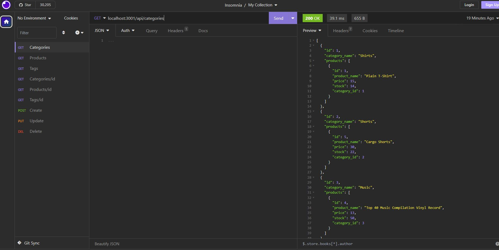

# ORM for E-Commerce Back End
Back end application of an e-commerce site.

# Table of Contents
* [User Story](#userstory)
* [Acceptance Criteria](#acceptancecriteria)
* [Usage](#usage)
* [Installation](#installation)
* [Credits](#credits)

## User Story
> AS A manager at an internet retail company  
> I WANT a back end for my e-commerce website that uses the latest technologies  
> SO THAT my company can compete with other e-commerce companies  

## Acceptance Criteria
> GIVEN a functional Express.js API  
> WHEN I add my database name, MySQL username, and MySQL password to an environment variable file  
> THEN I am able to connect to a database using Sequelize  
> WHEN I enter schema and seed commands  
> THEN a development database is created and is seeded with test data  
> WHEN I enter the command to invoke the application  
> THEN my server is started and the Sequelize models are synced to the MySQL database  
> WHEN I open API GET routes in Insomnia Core for categories, products, or tags  
> THEN the data for each of these routes is displayed in a formatted JSON  
> WHEN I test API POST, PUT, and DELETE routes in Insomnia Core  
> THEN I am able to successfully create, update, and delete data in my database  

## Usage

Video Example: https://youtu.be/MxJge3xn59Q  

## Installation
Recommended to download Insomnia  

1. CLI: npm i init
2. CLI: npm i mysql2
3. CLI: npm i sequelize
4. CLI: npm i dotenv
5. CLI: npm i express
6. Update .env file to include DB_USER and DB_PW
7. Open CLI and log into mysql using "mysql -u root -p" command
8. mysql: "SOURCE db/schema.sql" and exit
9. CLI: node seeds/index.js
10. CLI: node server.js

